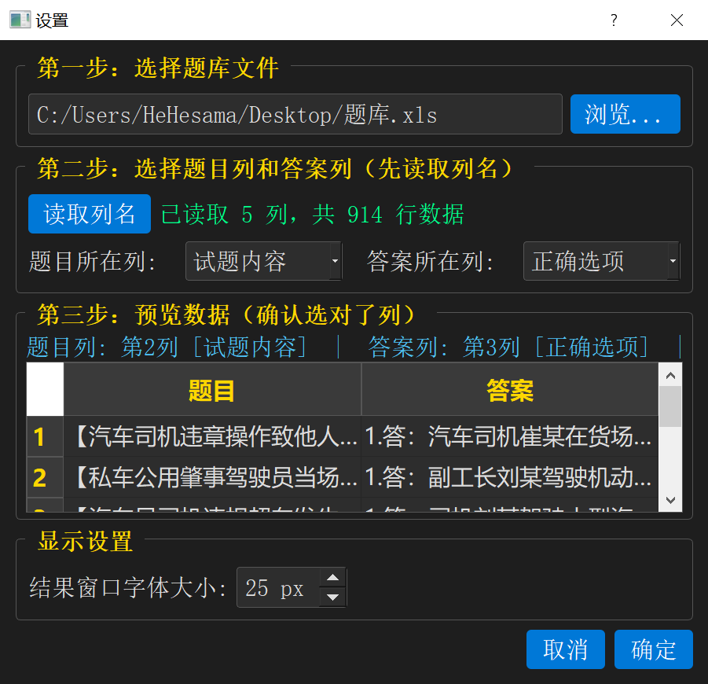
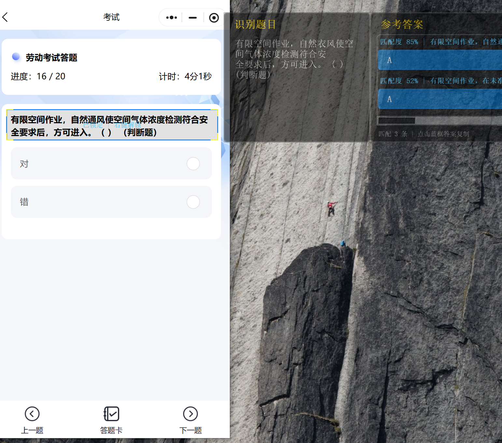

<p align="center">
  
</p>

<h1 align="center">晨星答题参考助手-桌面版 3.0</h1>

<p align="center">基于 OCR 识别的实时答题参考工具</p>

<p align="center">
  
  
  
</p>

<p align="center">
  <b>移动版请访问：</b>
  <a href="https://github.com/Huoxing999/answer_assistant_flutter">answer_assistant_flutter</a>
</p>

---

<h2 align="center">效果展示</h1>

<p align="center">
  
  
</p>

## 功能特性

- **实时 OCR 识别**：框选屏幕区域，自动识别题目文字
- **智能题库匹配**：模糊匹配题库中的题目，显示匹配度
- **自动复制答案**：识别到题目后自动复制最佳答案到剪贴板
- **答案选项补全**：题库答案为 A/B/C/D 时，自动显示对应选项内容，如「A 汽车」
- **点击复制**：点击题目或答案文本直接复制到剪贴板
- **独立窗口设计**：识别框和结果窗口分离，可自由摆放
- **自定义题库**：支持 .xls、.xlsx、.csv 格式，可自定义题目列和答案列
- **字体大小调节**：可自定义结果窗口字体大小
- **设置自动保存**：题库路径、列选择、字体大小自动保存
- **后台 OCR**：OCR 与题库匹配在后台执行，降低界面卡顿

## 快速开始（懒人包）

需要已安装 Python 3.8+（需添加到 PATH），首次运行需联网下载依赖和模型：

1. 下载 [答题参考助手_懒人包.zip](../../releases/latest)
2. 解压到任意目录
3. 双击 `答题参考助手.exe` 即可使用

首次运行会自动安装 Python 依赖并下载 OCR 模型（约 100MB），后续运行无需联网。

## 从源码运行

### 环境要求

- Windows 10/11
- Python 3.8+
- 首次运行需联网（下载 OCR 模型）

### 安装步骤

**1. 安装 Python 依赖**

```bash
pip install -r requirements.txt
```

**2. 启动程序**

```bash
python main.py
```

首次运行会自动下载 EasyOCR 模型（约 100MB），后续运行无需联网。

也可以使用一键启动器，自动处理依赖安装：

```bash
python launch.py
```

### 准备题库

支持 .xls、.xlsx、.csv 格式，第一行为表头，后续行为数据。

## 使用方法

### 首次使用

1. 启动后弹出设置对话框，点击「浏览」选择题库文件
2. 点击「读取列名」加载表头
3. 从下拉菜单选择题目列和答案列
4. 预览表格确认选择正确，点击「确定」

### 操作流程

1. **调整识别框**（绿色边框）— 拖拽移动，拖拽边缘缩放，覆盖题目区域
2. **锁定识别框** — 右键菜单 → 锁定选框，边框变蓝开始识别
3. **查看结果** — 结果窗口显示题目和匹配答案，最佳答案自动复制
4. **点击复制** — 点击题目或答案文本直接复制到剪贴板
5. **修改设置** — 识别框右键菜单 → 题库设置

## 文件说明

```
answer-assistant-ocr/
├── main.py              # 主程序入口
├── config.py            # 配置文件
├── overlay.py           # 窗口界面（识别框 + 结果窗口）
├── capture.py           # 屏幕截图和图像哈希
├── ocr_engine.py        # OCR 识别引擎（EasyOCR）
├── question_bank.py     # 题库加载和匹配
├── settings_dialog.py   # 设置对话框
├── launch.py            # 一键启动器（自动安装依赖）
├── launcher.py          # exe 启动器源码
├── build.py             # PyInstaller 打包脚本
├── 启动答题助手.bat      # Windows 批处理启动入口
├── app_icon.ico         # 程序图标
└── requirements.txt     # Python 依赖
```

## 配置说明

`config.py` 中的可配置项：

| 配置项 | 默认值 | 说明 |
|--------|--------|------|
| POLL_INTERVAL | 0.5 | 轮询间隔（秒） |
| CHANGE_THRESHOLD | 2 | 画面变化检测阈值 |
| MATCH_THRESHOLD | 0.35 | 匹配相似度阈值 |
| MAX_RESULTS | 3 | 最大显示结果数 |
| FONT_SIZE | 25 | 默认字体大小（px） |

## 常见问题

**OCR 识别不到文字**
- 确保识别框完全覆盖题目文字
- 检查 `debug/` 目录下的调试图像
- 确认 EasyOCR 模型已下载（首次运行需联网）

**匹配不到题目**
- 检查题库文件是否正确加载
- 确认题目列和答案列选择正确
- 降低 `MATCH_THRESHOLD` 值（如改为 0.2）

## 技术栈

- **GUI**：PyQt5
- **OCR**：EasyOCR（基于 PyTorch，中文识别效果优秀）
- **匹配算法**：SequenceMatcher 模糊匹配 + 倒排索引加速

## 许可证

MIT License

版权所有@七八个星天外
